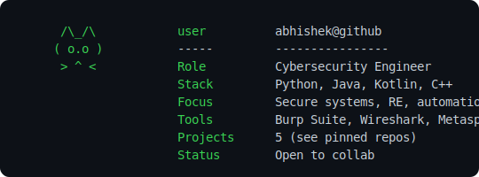

# 👋 Hey, I'm Abhishek🧿

> 🎯 **Cybersecurity Engineer | Developer | Open Source Contributor**

I'm a **Computer Science graduate** with a keen interest in **cybersecurity**, **software engineering**, and **automation scripting**.

---

## 🚀 Notable Projects

- 🔋 [**Juice Judge**](https://github.com/ash3-s/battery-predict) — battery-life predictor for Meet calls
- 🔐 **Keystroke Dynamics Auth** — continuous behavioral authentication over WebSocket
- 🖼️ [**Steganographic Image Encryption**](https://github.com/Abhishek-s-kumar/AICTE-internship-project)
- 📀 [**USB Automation Script**](https://github.com/Abhishek-s-kumar/usb_keylogger.git)
- 🚗 [**Secure VANET Simulation (HECC)**](https://github.com/Abhishek-s-kumar/HECVANET)

---

## 🐍 Live Contribution Graph

<picture>
  <source media="(prefers-color-scheme: dark)" srcset="https://raw.githubusercontent.com/Abhishek-s-kumar/Abhishek-s-kumar/output/snake-dark.svg" />
  
</picture>

---

## 🛠️ Technical Toolkit

**Languages:** Java, Python, C++, C, Kotlin, Dart, HTML
**Tools:** Git, Docker, Jenkins, GitHub Actions, Android Studio, NGINX, Apache
**Security:** Burp Suite, OWASP ZAP, FTK, Autopsy, Nmap, Wireshark, Hashcat, Metasploit, Wazuh

---

## 🌐 Socials

